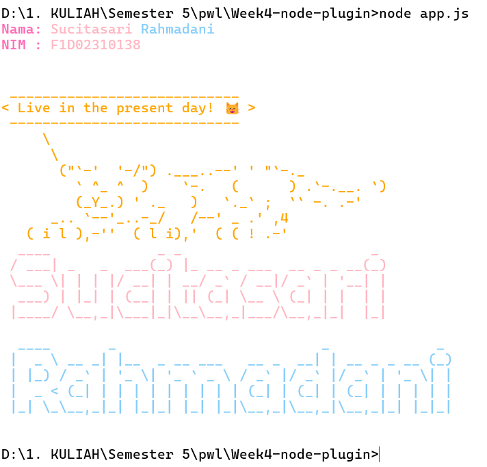

# Week4-node-plugin

## Cara Menginstal Dependensi

Ikuti langkah-langkah berikut untuk menginstal dependensi pada project ini:

1. **Pastikan Node.js sudah terpasang di komputer Anda.**  
   Cek versi Node.js dengan perintah:
   ```sh
   node --version
   ```
   Jika belum terpasang, download di: https://nodejs.org/

2. **Buat folder project dan masuk ke dalamnya:**
   ```sh
   mkdir t1-week4
   cd t1-week4
   ```

3. **Inisialisasi project Node.js:**
   ```sh
   npm init -y
   ```

4. **Buka folder project di Visual Studio Code (opsional):**
   ```sh
   code .
   ```

5. **Install dependensi yang dibutuhkan:**
   ```sh
   npm install chalk cowsay figlet
   ```

6. Setelah proses selesai, semua dependensi akan terpasang di folder `node_modules`.

7. **Untuk menjalankan aplikasi:**
   ```sh
   node app.js
   ```

## Dependensi yang digunakan
- [chalk](https://www.npmjs.com/package/chalk)
- [cowsay](https://www.npmjs.com/package/cowsay)
- [figlet](https://www.npmjs.com/package/figlet)

## Langkah-langkah untuk menjalankan proyek

Setelah menginstal dependensi, 

1. **Buat file utama pada vscode, `app.js`:**
2. **Buka file `app.js` dan pada code di bawah merupakan contoh penggunaan dependensi:**
   ```js
   // app.js
   const chalk = require('chalk');
   const cowsay = require('cowsay');
   const figlet = require('figlet');

   // Menampilkan teks dengan figlet
   figlet('Hello, Node.js!', (err, data) => {
     if (err) {
       console.log('Figlet error:', err);
       return;
     }
     console.log(chalk.green(data));
     // Menampilkan pesan dengan cowsay
     console.log(
       chalk.blue(
         cowsay.say({
           text: 'Selamat datang di Week4-node-plugin!',
           e: '^^',
           T: 'U '
         })
       )
     );
   });
   ```
3. Run program pada cmd
      ```sh
   
   ```

5. **Jika berhasil, Anda akan melihat teks ASCII art dari figlet dan pesan dari cowsay di terminal.**

```markdown

```

---

Dengan langkah-langkah di atas, Anda sudah berhasil membuat dan menjalankan proyek Node.js sederhana menggunakan `chalk`, `cowsay`, dan `figlet